# BabyClaw — System Design Diagram

Render with any Mermaid-compatible viewer (GitHub, VS Code + Mermaid extension, https://mermaid.live).

```mermaid
flowchart TD
    %% ─── USER LAYER ───────────────────────────────────────────────────────────
    USER(["👤 User"])

    %% ─── INTERFACE LAYER ──────────────────────────────────────────────────────
    subgraph INTERFACE["Interface Layer"]
        CLI["CLI\nsrc/app/Main.py"]
        GUI["Web GUI\nsrc/app/gui.py\n(Flask · port 5000)"]
    end

    %% ─── COORDINATOR ──────────────────────────────────────────────────────────
    subgraph COORD["Coordinator  (src/core/workflow/Coordinator.py)"]
        direction TB
        C_ROUTE["① run_router()"]
        C_CTX["② resolve_context()"]
        C_MEM["③ build_scoped_context()"]
        C_PLAN["④ build_planner_input()"]
        C_EXEC["⑤ run_execution_loop()"]
        C_REVIEW["⑥ continue_workflow()"]
        C_STORE["⑦ store_long_term_memory()"]
        C_RESP["⑧ build_success_message()"]
        C_ROUTE --> C_CTX --> C_MEM --> C_PLAN --> C_EXEC --> C_REVIEW --> C_STORE --> C_RESP
    end

    %% ─── AGENTS ───────────────────────────────────────────────────────────────
    subgraph AGENTS["Agent Layer"]
        direction LR

        subgraph RA["RouteAgent\n(src/agents/routing/)"]
            RA1["Classify task type\n6 route categories\nJSON schema output"]
        end

        subgraph PA["PlannerAgent\n(src/agents/planning/)"]
            PA1["Generate step plan\nDependency-aware\nTool-scoped"]
            PA2["PlanCompiler\nValidates tools,\npaths, *_step refs"]
            PA1 --> PA2
        end

        subgraph EA["ExecutorAgent\n(src/agents/execution/)"]
            EA1["Resolve step args\n*_step references"]
            EA2["Snapshot → Execute\n→ Rollback log"]
            EA3["Track execution_trace"]
            EA1 --> EA2 --> EA3
        end

        subgraph REV["ReviewerAgent\n(src/agents/reviewing/)"]
            REV1["Deterministic checks\n(fast path)"]
            REV2["LLM semantic review\n(fallback)"]
            REV1 --> REV2
        end

        subgraph MA["MemoryAgent\n(src/agents/memory/)"]
            MA1["Extract memories\nvia LLM"]
            MA2["Retrieve relevant\nmemories"]
        end
    end

    %% ─── SUPPORT COMPONENTS ───────────────────────────────────────────────────
    subgraph SUPPORT["Support Components"]
        direction LR

        subgraph CTX_RES["ContextResolver\n(src/core/context/)"]
            CR1["Resolve pronouns &\ncontextual phrases\n(no LLM — deterministic)"]
        end

        subgraph AC["ActiveContext\n(src/core/context/)"]
            AC1["Session state:\nlast file, last response,\nlast generated content"]
        end

        subgraph EV["ExecutionVerifier\n(src/core/workflow/)"]
            EV1["Verify workspace\nmatches execution claims\n(no LLM — deterministic)"]
        end

        subgraph WP["WorkflowPolicy\n(src/agents/routing/)"]
            WP1["Immutable route rules:\ntool_group · memory_mode\nallow_mutations"]
        end

        subgraph MRP["MemoryRoutingPolicy\n(src/agents/routing/)"]
            MRP1["Deterministic:\nnone / pinned_only /\nrelevant_only / full"]
        end
    end

    %% ─── TOOL LAYER ───────────────────────────────────────────────────────────
    subgraph TOOLS["Tool Registry  (src/tools/tool_registry.py)"]
        direction LR
        T_CHAT["Direct Response\ndirect_response\ngenerate_content\n(call Ollama)"]
        T_READ["Read Tools\nread_file · list_dir\nfind_file · search_text"]
        T_SUM["Summarise\nsummarise_txt\n(calls Ollama)"]
        T_MUT["Mutation Tools ⚠\ncreate/write/append/delete_file\ncreate/delete_dir · move · copy\n(require user permission)"]
    end

    %% ─── OLLAMA / LLM LAYER ───────────────────────────────────────────────────
    subgraph LLM["LLM Layer  (src/llm/OllamaClient.py)"]
        OLLAMA[["Ollama\nqwen2.5:3b\ntemp=0 · top_p=0.1"]]
        LLM_LOG["llm_calls.jsonl\n(audit log)"]
        OLLAMA --> LLM_LOG
    end

    %% ─── STORAGE LAYER ────────────────────────────────────────────────────────
    subgraph STORAGE["Storage Layer"]
        direction LR
        SQL[("SQLite\nMemory/memory.db\nAll agent messages\n+ audit trail")]
        CHROMA[("ChromaDB\nMemory/chroma_db\nVector embeddings\nSemantic search")]
        WS_DIR[("Workspace\n/workspace/\nSandboxed file ops")]
        CFG["config/workspace_config.json"]
    end

    %% ─── PERMISSION GATE ──────────────────────────────────────────────────────
    PERM{{"⚠ Permission Gate\npermission_request msg\nUser must approve\nbefore mutation"}}

    %% ─── ROLLBACK ─────────────────────────────────────────────────────────────
    ROLLBACK["Rollback Engine\nReverse-order snapshot\nrestore on rejection"]

    %% ═══════════════════════════════════════════════════════════════════════════
    %% CONNECTIONS
    %% ═══════════════════════════════════════════════════════════════════════════

    %% User ↔ Interface
    USER -->|"task / reply"| CLI
    USER -->|"task / reply"| GUI
    CLI -->|"response"| USER
    GUI -->|"response"| USER

    %% Interface → Coordinator
    CLI -->|"user_message"| COORD
    GUI -->|"user_message"| COORD
    COORD -->|"workflow_result\nassistant_message"| CLI
    COORD -->|"workflow_result\nassistant_message"| GUI

    %% Coordinator → Agents (workflow steps)
    C_ROUTE -->|"task text"| RA
    RA -->|"route message\n(task_type)"| C_CTX
    C_CTX -->|"needs context\nresolution"| CTX_RES
    CTX_RES -->|"resolved_references\nor clarification"| C_MEM
    C_MEM -->|"task + memory_mode"| MA2
    MA2 -->|"relevant memories\n(pinned + vector)"| C_PLAN
    C_PLAN -->|"task + tools + context\n+ constraints"| PA
    PA -->|"validated plan\n(goal + steps)"| C_EXEC
    C_EXEC -->|"runnable steps"| EA

    %% ExecutorAgent → Permission → user
    EA -->|"mutation step found"| PERM
    PERM -->|"permission_request msg"| USER
    USER -->|"yes / no"| PERM
    PERM -->|"approved → continue\ndenied → cancel"| C_EXEC

    %% ExecutorAgent → Tools
    EA -->|"invoke tool"| T_CHAT
    EA -->|"invoke tool"| T_READ
    EA -->|"invoke tool"| T_SUM
    EA -->|"invoke tool"| T_MUT

    %% Tool ↔ Workspace
    T_READ -->|"read"| WS_DIR
    T_MUT -->|"write/create/delete"| WS_DIR

    %% Execution → Verifier → Review
    EA -->|"execution_trace\nworkspace_before/after"| EV
    EV -->|"deterministic\naccept / reject"| C_REVIEW
    EV -->|"if accepted →\nproceed to LLM review"| REV
    REV -->|"review_result\n(accepted / issues)"| C_REVIEW

    %% Rejection → Rollback → Replan (up to 3 iterations)
    C_REVIEW -->|"rejected (< 3 iterations)\n+ replan feedback"| ROLLBACK
    ROLLBACK -->|"workspace restored"| C_PLAN
    C_REVIEW -->|"accepted"| C_STORE

    %% Memory store after success
    C_STORE -->|"execution_trace\n+ conversation"| MA1
    MA1 -->|"memory_store msg"| C_RESP

    %% ActiveContext updates
    C_RESP -->|"update_from_execution()"| AC
    AC -->|"session state for\nreference resolution"| CTX_RES

    %% Policy lookups
    C_ROUTE -->|"task_type"| WP
    WP -->|"WorkflowPolicy\n(scoped tools + mode)"| C_MEM
    C_MEM -->|"task_type + keywords"| MRP
    MRP -->|"MemoryRoutingDecision\n(mode + k)"| MA2

    %% Ollama calls (all agents that use LLM)
    RA -->|"invoke_json()\ntask classification"| OLLAMA
    PA -->|"invoke_json()\nplan generation"| OLLAMA
    REV -->|"invoke_json()\nsemantic review"| OLLAMA
    MA1 -->|"invoke_json()\nmemory extraction"| OLLAMA
    T_CHAT -->|"invoke_text()\nchat + generation"| OLLAMA
    T_SUM -->|"invoke_text()\nsummarisation"| OLLAMA

    %% Storage
    MA -->|"store_message()\nall agent messages"| SQL
    SQL -->|"get_recent_messages()"| MA2
    MA1 -->|"store_memory()"| CHROMA
    CHROMA -->|"retrieve_relevant_memory()\nsemantic search"| MA2
    CLI -->|"load workspace path"| CFG
    GUI -->|"load workspace path"| CFG

    %% ─── STYLING ──────────────────────────────────────────────────────────────
    classDef agent     fill:#dbeafe,stroke:#2563eb,color:#1e3a5f
    classDef support   fill:#fef9c3,stroke:#ca8a04,color:#713f12
    classDef llm       fill:#dcfce7,stroke:#16a34a,color:#14532d
    classDef storage   fill:#fce7f3,stroke:#db2777,color:#831843
    classDef tool      fill:#ede9fe,stroke:#7c3aed,color:#3b0764
    classDef gate      fill:#fee2e2,stroke:#dc2626,color:#7f1d1d
    classDef coord     fill:#e0f2fe,stroke:#0284c7,color:#0c4a6e
    classDef interface fill:#f0fdf4,stroke:#15803d,color:#14532d

    class RA,PA,EA,REV,MA agent
    class CTX_RES,AC,EV,WP,MRP support
    class OLLAMA,LLM_LOG llm
    class SQL,CHROMA,WS_DIR,CFG storage
    class T_CHAT,T_READ,T_SUM,T_MUT tool
    class PERM,ROLLBACK gate
    class C_ROUTE,C_CTX,C_MEM,C_PLAN,C_EXEC,C_REVIEW,C_STORE,C_RESP coord
    class CLI,GUI interface
```

---

## Component Reference

| Component | File | LLM? | Role |
|---|---|---|---|
| **Coordinator** | `src/core/workflow/Coordinator.py` | No | Orchestrates all agents; manages state, guards, rollback |
| **RouteAgent** | `src/agents/routing/RouteAgent.py` | **Yes** | Classifies task into 6 route types via JSON schema |
| **PlannerAgent** | `src/agents/planning/PlannerAgent.py` | **Yes** | Generates dependency-aware step plan |
| **PlanCompiler** | `src/agents/planning/PlanCompiler.py` | No | Validates plan: tools, paths, `*_step` refs, cycles |
| **ExecutorAgent** | `src/agents/execution/ExecutorAgent.py` | No | Resolves args, captures snapshots, runs tools |
| **ExecutionVerifier** | `src/core/workflow/ExecutionVerifier.py` | No | Deterministically verifies workspace state post-execution |
| **ReviewerAgent** | `src/agents/reviewing/ReviewerAgent.py` | **Yes** | Semantic review of result quality and correctness |
| **MemoryAgent** | `src/agents/memory/MemoryAgent.py` | **Yes** | Stores/retrieves long-term facts and preferences |
| **ContextResolver** | `src/core/context/ContextResolver.py` | No | Resolves pronouns ("it", "the file") to concrete state |
| **ActiveContext** | `src/core/context/ActiveContext.py` | No | Tracks session state: last file, last response, etc. |
| **WorkflowPolicy** | `src/agents/routing/WorkflowPolicy.py` | No | Immutable per-route tool scope + memory mode rules |
| **MemoryRoutingPolicy** | `src/agents/routing/MemoryRoutingPolicy.py` | No | Deterministic memory visibility rules per task type |
| **OllamaClient** | `src/llm/OllamaClient.py` | — | HTTP client for Ollama; `invoke_text` / `invoke_json` |
| **Tool Registry** | `src/tools/tool_registry.py` | Partial | 15 tools across chat, read, summarise, mutation groups |

## Key Design Principles

1. **LLM provides reasoning; infrastructure provides control.** Only 4 agents call Ollama; all validation and routing is deterministic Python.
2. **Strict scoping.** WorkflowPolicy maps task type → allowed tools; the LLM never sees tools outside its route.
3. **Permission gates.** Every mutation tool requires explicit user approval before execution.
4. **Rollback safety.** Snapshots captured before every mutation; reversed if reviewer rejects the result.
5. **Replan loop.** Up to 3 iterations: plan → execute → verify → review → if rejected, feedback + replan.
6. **No LLM pronoun guessing.** ContextResolver deterministically maps "it" / "the file" from ActiveContext session state.
